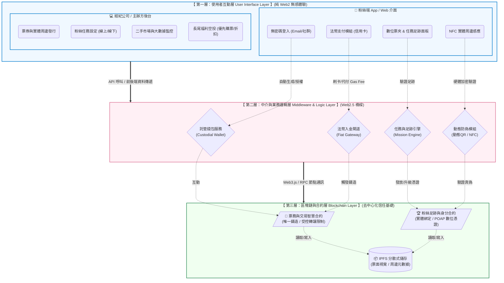

## 系統架構圖

```mermaid
flowchart TD
    %% 定義顏色與樣式
    classDef uiLayer fill:#f0f8ff,stroke:#007acc,stroke-width:2px,color:#333
    classDef midLayer fill:#fff0f5,stroke:#db7093,stroke-width:2px,color:#333
    classDef blockLayer fill:#f0fff0,stroke:#2e8b57,stroke-width:2px,color:#333

    %% 第一層：使用者互動層
    subgraph Layer1 ["【 第一層：使用者互動層 User Interface Layer 】(純 Web2 無感體驗)"]
        direction LR
        subgraph Fan ["📱 粉絲端 App / Web 介面"]
            direction TB
            F1("無密碼登入 (Email/社群)")
            F2("法幣支付模組 (信用卡)")
            F3("數位票夾 & 任務足跡面板")
            F4("NFC 實體周邊感應")
        end
        
        subgraph Admin ["💻 經紀公司 / 主辦方後台"]
            direction TB
            A1("票券與實體周邊發行")
            A2("粉絲任務設定 (線上/線下)")
            A3("二手市場與大數據監控")
            A4("長尾福利空投 (優先購票/折扣)")
        end
    end

    %% 第二層：中介與業務邏輯層
    subgraph Layer2 ["【 第二層：中介與業務邏輯層 Middleware & Logic Layer 】(Web2.5 橋樑)"]
        direction LR
        M1{"託管錢包服務\n(Custodial Wallet)"}
        M2{"法幣入金閘道\n(Fiat Gateway)"}
        M3{"任務與足跡引擎\n(Mission Engine)"}
        M4{"動態防偽模組\n(動態QR / NFC)"}
    end

    %% 第三層：區塊鏈與合約層
    subgraph Layer3 ["【 第三層：區塊鏈與合約層 Blockchain Layer 】(去中心化信任基礎)"]
        direction LR
        SC1[/"📝 票務與交易智慧合約\n(唯一鑄造 / 受控轉讓限制)"/]
        SC2[/"🏆 粉絲足跡與身分合約\n(實體綁定 / POAP 數位憑證)"/]
        IPFS[("📦 IPFS 分散式儲存\n(票面視覺 / 周邊元數據)")]
    end

    %% 層級之間的互動線
    Layer1 ====> |"API 呼叫 / 前後端資料傳遞"| Layer2
    Layer2 ====> |"Web3.js / RPC 節點通訊"| Layer3

    %% 細部功能關聯線 (虛線表示特定資料流)
    F1 -.-> |"自動生成/授權"| M1
    F2 -.-> |"刷卡/代付 Gas Fee"| M2
    F3 -.-> |"驗證足跡"| M3
    F4 -.-> |"硬體加密驗證"| M4

    M1 -.-> |"互動"| SC1
    M2 -.-> |"觸發鑄造"| SC1
    M3 -.-> |"發放/升級憑證"| SC2
    M4 -.-> |"驗證真偽"| SC2
    
    SC1 -.-> |"讀取/寫入"| IPFS
    SC2 -.-> |"讀取/寫入"| IPFS

    %% 套用樣式
    class Layer1,Fan,Admin uiLayer
    class Layer2 midLayer
    class Layer3 blockLayer
```
